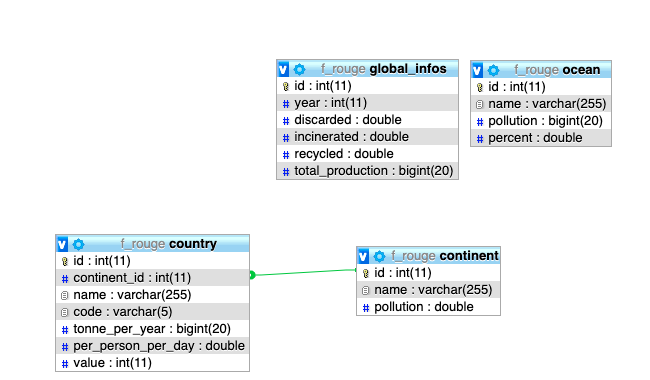

<li>Rémi Cakir (développement back)</li>

# Diagramme

Les données originales étaient toutes séparées, prenons l'entité **Country** comme exemple:

Le champ **tonne_per_year** correspondait à un fichier JSON qui avait comme clef:

1. Le nom du pays
2. La production de plastique en tonne par année
3. Le code pays à 2 lettres

Le champ **per_person_per_day** correspondait à un autre fichier JSON qui avait comme clef:

1. Le nom du pays
2. La consomation par personne et par jour
3. Le code pays à 2 lettres

Pour rassembler les données des pays dans un seul et unique fichier que j'ai appelé countries-infos.json situé dans api/asset/json, j'ai utilisé node.js pour manipuler les fichiers (écrire, lire) et réunir les données en faisant correspondre le nom du pays.

Concernant le champ **value**, en même temps que je réunissais les données j'ai calculé le pourcentage de production par rapport aux autres pays. value = tonne_per_year / total_tonne_per_year, j'aurais pu faire une route faisant exactement la même chose dans le controller mais j'ai préferé le mettre directement dans le fichier json.

Puis pour finir j'ai du rajouter à la main le nom des continents/régions dans le fichier JSON pour pouvoir lier l'entité **Country** à l'entité **Continent**.
J'ai voulu faire un script pour affecter à un pays son continent mais je n'ai pas pu car les données des continents que l'ont a récolté son groupées par région et non par continent, ainsi on pouvait avoir une région nommé East Asia and Pacific, ou encore Central Asia and Europe.

## Relation

La BDD contient qu'une relation de type ManyToOne,
un **continent** peut avoir plusieurs **pays** mais un **pays** peu avoir qu'un seul **continent**.

J'ai commencé par créer l'entité **Country**, puis j'ai créer l'entité **Continent** avec un champ relié à **Country**.

Cela a automatiquement créer un champ **continent_id** dans l'entité **Country**, puis pour hydrater ma BDD j'ai utilisé des fixtures, j'ai donc commencé par load les Continents fixtures en premier en prenant soin d'enregistrer le nom du continent comme réference, puis une fois terminé j'ai load les fixtures des Country et je faisais correspondre le nom du continent dans le fichier JSON avec la réference du nom du continent

## API

J'ai installé Api platform (pour la documentation de l'api)
mas j'ai quand même utilisé des controllers.
Comme vous avez pu le voir sur le schema MCD, il n'y a pas beaucoup de table et qu'une seule relation j'ai donc créer mes entités en fonction des données récoltées et j'ai créer des routes pour faciliter le plus possible les appels pour le front

## Documentation

La documentation n'est pas terminé, elle est généré automatiquement avec Api platform mais je n'ai pas eu le temps de la terminer car ce n'était pas la priorité avant le rendu.
